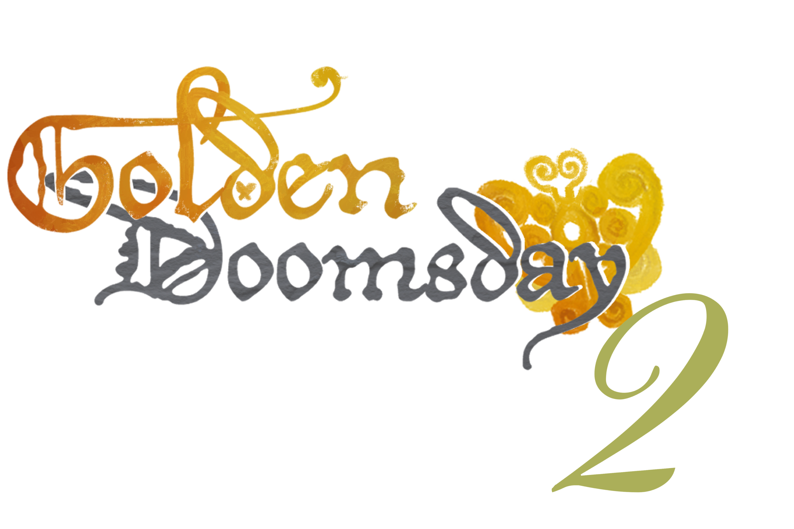
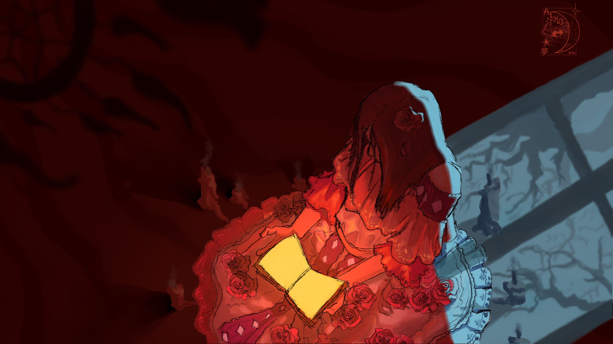

### Golden Doomsday 2

## Historia

En un mundo donde los recursos naturales fueron explotados hasta su fin, una bruja registró todo el mundo anterior a la extinción en varios libros, y después con gran poder, y sacrificando su existencia logró darle vida a estos mundos de nuevo dentro de sus libros. 

Maala, una nación en busca de recursos para explotar se enteró de estos, y de un precioso y mágico mineral llamado Sua, entró a los libros buscando causar una nueva extinción. 

El protagonista, Sué, fue elegido por la bruja para portar el poder del Sua y salvar lo que queda de los ecosistemas
